```mermaid
gantt
    title Latency Comparison (TypeScript Core - 1,000 Requests)
    dateFormat X
    axisFormat %s

    section Without VibeShield
    Total DB Fetch Time (9233ms) : 0, 9233

    section With VibeShield
    Cached Fetch Time (130ms) : 0, 130
```

# 🛡️ VibeShield

> **AI writes your code. VibeShield protects your database and your wallet.**  
> A lightweight, dual-stack, zero-configuration (plug-and-play) security and performance middleware layer designed for Next.js (TypeScript) and Python (FastAPI / Flask) web applications.

[](https://choosealicense.com/licenses/mit/)
[](http://makeapullrequest.com)

---

## 💡 Why VibeShield?

With the rise of "vibe coding" and AI-assisted tools like Cursor, Claude, and Bolt, building functional applications has never been faster. However, AI-generated code often misses critical **security sanitization** and **performance optimizations**, leaving production environments exposed to severe security flaws, database overload, and unexpected cloud bills.

**VibeShield** acts as a bulletproof vest for your API routes. It intercepts incoming requests using high-performance middleware mechanisms to deep-sanitize malicious payloads and automatically cache expensive operations — all with **zero configuration**.

---

## 📊 Empirical Security & Performance Benchmarks

We executed live hacker attack simulations and high-traffic throughput tests (1,000 rapid concurrent requests) against raw AI-generated endpoints versus the same endpoints protected by VibeShield.

---

## 🛡️ 1. Security & Sanitization Showcase (Before vs. After)

| Attack Vector | Input Payload | Without VibeShield (Raw AI Code) | With VibeShield Layer | Security Status |
| :--- | :--- | :--- | :--- | :--- |
| **SQL Injection (SQLi)** | `{"username": "admin' OR '1'='1"}` | Passes raw SQLi string directly to DB | `{"username": "admin'' OR ''1''=''1"}` | **🟢 SECURED** (Auto-escaped quotes) |
| **NoSQL Operator Injection** | `{"password": {"$ne": "admin"}}` | Bypasses authentication via MongoDB operator | `{"password": {}}` | **🟢 SECURED** (Dollar-prefixed keys stripped) |
| **Cross-Site Scripting (XSS)** | `{"comment": "<script>...</script>Nice!"}` | Echoes malicious script back raw | `{"comment": "Nice!"}` | **🟢 SECURED** (Malicious tags removed) |

---

## ⚡ 2. Database Load & Latency Optimization (1,000 Requests)

### 🟩 TypeScript Ecosystem (Next.js App Router)

- **Performance Speedup:** **70.7x faster** response delivery.
- **Database Latency Reduction:** **98.59% lower** execution time.
- **Database Load Reduction:** **99.90% fewer queries** hitting the database.

| Metric | Without Cache (Direct DB Calls) | With VibeShield (In-Memory Cache) | Improvement |
| :--- | :--- | :--- | :--- |
| **Total Test Duration** | `9,233.61 ms` | `130.52 ms` | **-9,103.09 ms (-98.59%)** |
| **Average Response Latency** | `9.23 ms / req` | `0.13 ms / req` | **70.7x Faster** |
| **Database Queries Executed** | `1,000` | `1` | **99.90% Load Reduction** |

### 🟨 Python Ecosystem (FastAPI / Flask)

- **Performance Speedup:** **27.7x faster** response delivery.
- **Database Latency Reduction:** **96.39% lower** execution time.
- **Database Load Reduction:** **99.90% fewer queries** hitting the engine.

| Metric | Without Cache (Direct DB Calls) | With VibeShield (In-Memory Cache) | Improvement |
| :--- | :--- | :--- | :--- |
| **Total Test Duration** | `15,492.49 ms` | `558.53 ms` | **-14,933.96 ms (-96.39%)** |
| **Average Response Latency** | `15.49 ms / req` | `0.55 ms / req` | **27.7x Faster** |
| **Database Queries Executed** | `1,000` | `1` | **99.90% Load Reduction** |

---

## 📈 Latency Visualization



---

## 🚀 Quick Start (Plug & Play)

### 🟩 TypeScript / Next.js

#### Installation

```bash
npm install @vibeshield/core
```

#### Usage in Next.js API Routes (`route.ts`)

VibeShield automatically detects and dynamically resolves Next.js 15 asynchronous Promise context parameters.

```ts
import { vibeShield } from '@vibeshield/core';
import { db } from '@/lib/db';

export const GET = vibeShield(async (req) => {
  const users = await db.user.findMany();

  return Response.json(users);
}, {
  cache: {
    enabled: true,
    ttl: 60
  },
  security: {
    sanitizeBody: true
  }
});
```

---

### 🟨 Python / FastAPI

#### Installation

```bash
pip install vibeshield-core
```

#### Usage in FastAPI

```python
from fastapi import FastAPI
from vibeshield.core import VibeShieldASGIMiddleware

app = FastAPI()

app.add_middleware(
    VibeShieldASGIMiddleware,
    cache_enabled=True,
    cache_ttl=60,
    sanitize_body=True
)
```

---

## 🤖 AI Bridge: Automated Implementation

VibeShield includes specialized `.cursorrules` files for both ecosystems. Drop them into your workspace, and your favorite AI assistant (Cursor, Claude, ChatGPT) will automatically format, wrap, and secure every newly generated endpoint using VibeShield.

This helps ensure insecure AI-generated code never reaches production environments.

---

## 🗺️ Roadmap

- [x] Next.js App Router Middleware (TypeScript)
- [x] FastAPI Middleware Support
- [x] Flask Middleware Support
- [x] Comprehensive Benchmark & Security Validation Suite
- [ ] Redis Distributed Cache Adapter
- [ ] Rate Limiting & Abuse Detection Layer
- [ ] Global Dashboard for `VS-XXXX` Error Tracking
- [ ] OpenTelemetry & Observability Integration

---

## 📄 License

Distributed under the MIT License. See `LICENSE` for more information.
